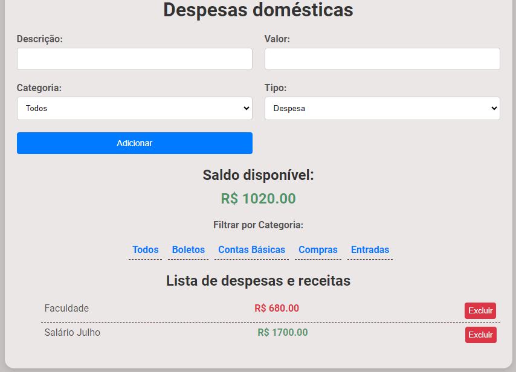

<h1 align="center"> Gerenciador de despesas </h1>

O site foi criado para armazenar informações básicas, como despesas, boletos e entradas, diretamente no localStorage da máquina, dispensando a necessidade de um banco de dados.    

  <a href="#-tecnologias">Tecnologias</a>&nbsp;&nbsp;&nbsp;|&nbsp;&nbsp;&nbsp;
  <a href="#-projeto">Projeto</a>&nbsp;&nbsp;&nbsp;|&nbsp;&nbsp;&nbsp;
  <a href="#-layout">Layout</a>&nbsp;&nbsp;&nbsp;|&nbsp;&nbsp;&nbsp;

 

  

## 🚀 Tecnologias

Esse projeto foi desenvolvido com as seguintes tecnologias:

- HTML, Javascript e CSS>
- Git e Github

## 💻 Projeto

O site foi desenvolvido com o objetivo de armazenar informações básicas diretamente no localStorage, ou seja, no armazenamento local da máquina, eliminando a necessidade de um banco de dados. Isso permite salvar detalhes sobre despesas mensais, boletos, compras e entradas, com a opção de categorizar cada item como despesa ou entrada ao concluir a adição de cada registro.
